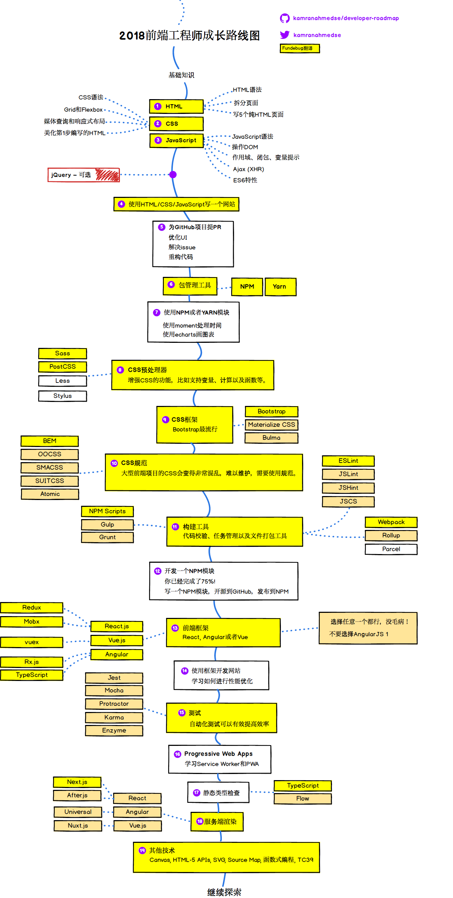
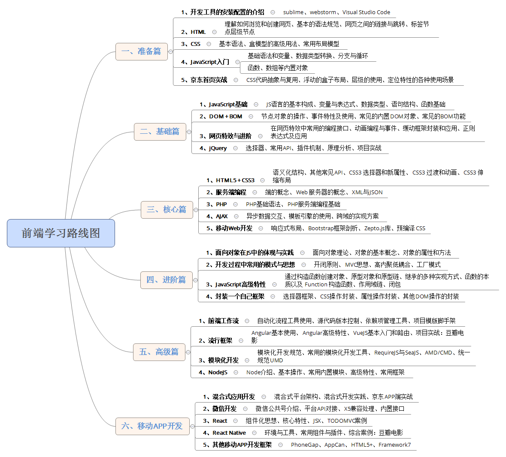

# 前端成长路线

## 前端成长路线图1
  

[developer-roadmap](https://github.com/kamranahmedse/developer-roadmap)

## 前端成长路线图2
  

# 前端书籍推荐

## Javascript

- [JavaScript高级程序设计](https://book.douban.com/subject/10546125/)
- [JavaScript语言精粹](https://book.douban.com/subject/3590768/)
- [JavaScript权威指南](https://book.douban.com/subject/10549733/)
- [JavaScript设计模式与开发实践](http://www.ituring.com.cn/book/1632/)
- [你不知道的JavaScript](https://book.douban.com/subject/26351021/)
- [高性能JavaScript](https://book.douban.com/subject/5362856/)
- [ECMAScript6入门](http://es6.ruanyifeng.com/)
- [重构：改善既有代码的设计](https://book.douban.com/subject/30468597/)
- 欢迎补充

## CSS

- [CSS权威指南](https://book.douban.com/subject/2308234/)
- 欢迎补充

## HTML

- [Head First HTML与CSS](https://book.douban.com/subject/25752357/)

- 欢迎补充

## 计算机相关

- [图解HTTP](https://book.douban.com/subject/25863515/)
- [HTTP权威指南](https://book.douban.com/subject/10746113/)
- [编码: 隐匿在计算机软硬件背后的语言](https://book.douban.com/subject/4822685/)
- 欢迎补充

## 程序员相关

- [代码大全第二版](https://book.douban.com/subject/1477390/)
- [SICP](https://book.douban.com/subject/1148282/) 
- [代码整洁之道:程序员的职业素养](https://book.douban.com/subject/26919457/)
- [程序员修炼之道:从小工到专家](https://book.douban.com/subject/5387402/) 
- [Web全栈工程师的自我修养](https://book.douban.com/subject/26598045/)
- 欢迎补充

## 项目分享

- https://rsuite.github.io/react-frame/
- [飞冰-让前端开发简单而友好](https://ice.work/docs/guide/about)
- [大前端工具集](https://github.com/nieweidong/fetool)