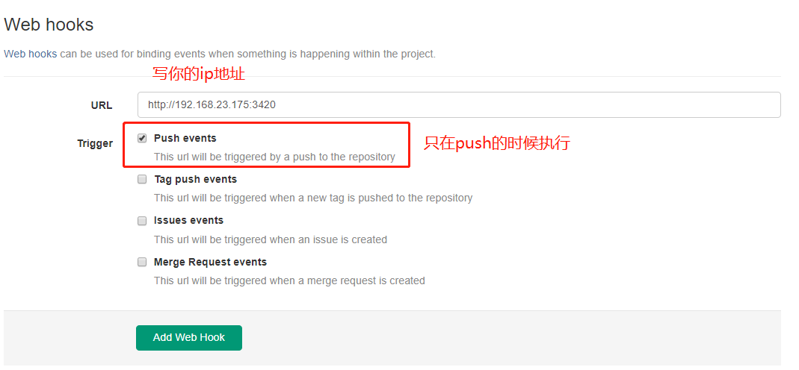

## ys-email-sender

一个利用GitLab Web Hook在push之后自动发送邮件的工具


## 使用

1. 请先在Gitlab`你的项目/Settings/Web Hooks`中添加一个web hook


2. 安装依赖
```bash
$ npm install
```

3. 配置，打开根目录下的config.js
```js
module.exports = {
	//你的邮箱地址
	email: 'email@yeastar.com',
	//你的邮箱密码或者客户端授权码
	password: 'emalPassword123',
	//发件人
	emailFrom: 'Name <email@yeastar.com>',
	//收件人，用,隔开
	emailTo: 'someone@yeastar.com',
	//邮件主题
	emailSubject: 'hello !',
	//邮件内容
	emailText: 'hello world',
	//web hook中写的端口
	port: 3420,
	//web hook中写的url
	host: '192.168.23.175'
};
```

4. 启动服务，开始监听push 事件
```bash
node index.js
```

5. 点开第一步的web hook界面，点击下面的test hook，测试看看邮件是否发送成功。

6. 测试成功后，以后就可以在push的时候开启服务，让它帮我们自动发送邮件了。


## TODO

- [ ] 支持多项目
- [ ] 支持手动发送
- [ ] 支持邮件预览

如果你认为这个工具有任何需要改进的地方，或者有任何问题，欢迎修改。